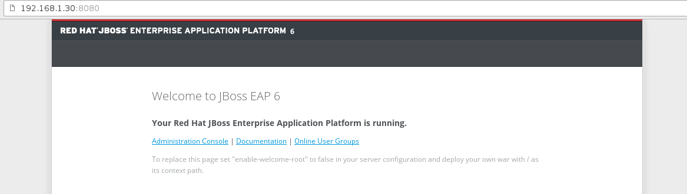

Instalar JBOSS EAP
===================

JBoss EAP (Enterprise Application Platform)Red Hat® JBoss® Enterprise Application Platform (JBoss EAP) proporciona seguridad, rendimiento y escalabilidad a nivel empresarial en cualquier entorno. Ya sea de forma local o virtual, o en nubes públicas, privadas o híbridas, JBoss EAP le puede ayudar a distribuir sus aplicaciones con mayor rapidez, en cualquier lugar.

JBoss Enterprise Application Platform (o JBoss EAP) es un servidor de aplicaciones Open Source basado en Java-EE

Descargamos e Instalamos el Java JDK
++++++++++++++++++++++++++++++++++++++

Descargamos el Java JDK http://www.oracle.com/technetwork/java/javase/downloads/index.html

::

	# rpm -ivh jdk-8u101-linux-x64.rpm

Verificamos la version.::

	# java -version
	java version "1.8.0_101"
	Java(TM) SE Runtime Environment (build 1.8.0_101-b13)
	Java HotSpot(TM) 64-Bit Server VM (build 25.101-b13, mixed mode)

Configuramos las variables de entorno JAVA_HOME , JBOSS_HOME y PATH, El java se instalo en "/usr/java/jdk1.8.0_101".::

	# vi /etc/profile
		# agregamos estas lineas y ya queda para todos los perfiles de usuario
		export JAVA_HOME=/usr/java/jdk1.8.0_101
		export JBOSS_HOME=/opt/jboss-eap-6.4
		export PATH=$PATH:$JAVA_HOME/jre/bin:$JBOSS_HOME

Descargamos el JBOSS EAP y lo instalamos
+++++++++++++++++++++++++++++++++++++++++

En este ejemplo fue la version 6.4 https://developers.redhat.com/products/eap/download/ .::

	# unzip jboss-eap-6.4.0.zip

Lo movemos al directorio opt.::

	# mv jboss-eap-6.4 /opt/

Creamos el usuario y grupo
++++++++++++++++++++++++++++

::

	# groupadd jboss
	# adduser -s /bin/bash -g jboss jboss

Podemos editar el .bash_profile para agregar las variables, recordemos que no es necesario porque ya lo configuramos en /etc/profile::

	# vi /home/jboss/.bash_profile
		export JAVA_HOME=/usr/java/jdk1.8.0_101
		export JBOSS_HOME=/opt/jboss-eap-6.4
		export PATH=$PATH:$JAVA_HOME/jre/bin:$JBOSS_HOME:$HOME/bin

Asignamos como propietario al usuario jboss la instalacion de JBoss EAP.::

	# chown -R jboss.jboss /opt/jboss-eap-6.4/

Ingresamos con el usuario jboss y verificamos la variable JAVA_HOME.::

	# su - jboss
	$ echo $JAVA_HOME
		/usr/java/jdk1.8.0_101

Ingresamos a la ruta bin de JBOSS_HOME y nos aseguramos que los scripts tengan el permisos de ejecucion.::

	$ cd /opt/jboss-eap-6.4/bin
	$ ls -l *.sh
	-rwxr-xr-x. 1 root root  2101 Mar 27  2015 add-user.sh
	-rwxr-xr-x. 1 root root  4480 Mar 27  2015 appclient.sh
	-rwxr-xr-x. 1 root root 11047 Mar 27  2015 domain.sh
	-rwxr-xr-x. 1 root root  2556 Mar 27  2015 jboss-cli.sh
	-rwxr-xr-x. 1 root root  2143 Mar 27  2015 jconsole.sh
	-rwxr-xr-x. 1 root root  1904 Mar 27  2015 jdr.sh
	-rwxr-xr-x. 1 root root   710 Mar 27  2015 run.sh
	-rwxr-xr-x. 1 root root 12287 Mar 27  2015 standalone.sh
	-rwxr-xr-x. 1 root root  2170 Mar 27  2015 vault.sh
	-rwxr-xr-x. 1 root root  2179 Mar 27  2015 wsconsume.sh
	-rwxr-xr-x. 1 root root  2001 Mar 27  2015 wsprovide.sh

Ahora verificamos el funcionamiento del JBoss.::

	$ /opt/jboss-eap-6.4/bin/standalone.sh 
	=========================================================================

	  JBoss Bootstrap Environment

	  JBOSS_HOME: /opt/jboss-eap-6.4

	  JAVA: /usr/java/jdk1.8.0_101/bin/java

	  JAVA_OPTS:  -server -XX:+UseCompressedOops -verbose:gc -Xloggc:"/opt/jboss-eap-6.4/standalone/log/gc.log" -XX:+PrintGCDetails -XX:+PrintGCDateStamps -XX:+UseGCLogFileRotation -XX:NumberOfGCLogFiles=5 -XX:GCLogFileSize=3M -XX:-TraceClassUnloading -Xms1303m -Xmx1303m -XX:MaxPermSize=256m -Djava.net.preferIPv4Stack=true -Djboss.modules.system.pkgs=org.jboss.byteman -Djava.awt.headless=true -Djboss.modules.policy-permissions=true

	=========================================================================

	Java HotSpot(TM) 64-Bit Server VM warning: ignoring option MaxPermSize=256m; support was removed in 8.0
	19:46:02,821 INFO  [org.jboss.modules] (main) JBoss Modules version 1.3.6.Final-redhat-1
	19:46:03,173 INFO  [org.jboss.msc] (main) JBoss MSC version 1.1.5.Final-redhat-1
	19:46:03,315 INFO  [org.jboss.as] (MSC service thread 1-2) JBAS015899: JBoss EAP 6.4.0.GA (AS 7.5.0.Final-redhat-21) starting
	19:46:05,728 INFO  [org.xnio] (MSC service thread 1-1) XNIO Version 3.0.13.GA-redhat-1
	19:46:05,748 INFO  [org.xnio.nio] (MSC service thread 1-1) XNIO NIO Implementation Version 3.0.13.GA-redhat-1
	19:46:05,778 INFO  [org.jboss.as.server] (Controller Boot Thread) JBAS015888: Creating http management service using socket-binding (management-http)
	19:46:05,835 INFO  [org.jboss.remoting] (MSC service thread 1-1) JBoss Remoting version 3.3.4.Final-redhat-1
	19:46:05,945 INFO  [org.jboss.as.clustering.infinispan] (ServerService Thread Pool -- 31) JBAS010280: Activating Infinispan subsystem.
	19:46:06,008 INFO  [org.jboss.as.jsf] (ServerService Thread Pool -- 37) JBAS012615: Activated the following JSF Implementations: [main, 1.2]
	19:46:06,092 INFO  [org.jboss.as.naming] (ServerService Thread Pool -- 39) JBAS011800: Activating Naming Subsystem
	19:46:06,154 INFO  [org.jboss.as.security] (ServerService Thread Pool -- 44) JBAS013371: Activating Security Subsystem
	19:46:06,175 WARN  [org.jboss.as.txn] (ServerService Thread Pool -- 46) JBAS010153: Node identifier property is set to the default value. Please make sure it is unique.
	19:46:06,200 INFO  [org.jboss.as.webservices] (ServerService Thread Pool -- 48) JBAS015537: Activating WebServices Extension
	19:46:06,235 INFO  [org.jboss.as.connector.logging] (MSC service thread 1-1) JBAS010408: Starting JCA Subsystem (IronJacamar 1.0.31.Final-redhat-1)
	19:46:06,644 INFO  [org.jboss.as.security] (MSC service thread 1-1) JBAS013370: Current PicketBox version=4.1.1.Final-redhat-1
	19:46:06,698 INFO  [org.jboss.as.connector.subsystems.datasources] (ServerService Thread Pool -- 27) JBAS010403: Deploying JDBC-compliant driver class org.h2.Driver (version 1.3)
	19:46:07,249 INFO  [org.jboss.as.naming] (MSC service thread 1-2) JBAS011802: Starting Naming Service
	19:46:07,328 INFO  [org.jboss.as.mail.extension] (MSC service thread 1-2) JBAS015400: Bound mail session [java:jboss/mail/Default]
	19:46:08,317 INFO  [org.apache.coyote.http11.Http11Protocol] (MSC service thread 1-1) JBWEB003001: Coyote HTTP/1.1 initializing on : http-/127.0.0.1:8080
	19:46:08,344 INFO  [org.apache.coyote.http11.Http11Protocol] (MSC service thread 1-1) JBWEB003000: Coyote HTTP/1.1 starting on: http-/127.0.0.1:8080
	19:46:08,904 INFO  [org.jboss.as.connector.subsystems.datasources] (MSC service thread 1-1) JBAS010400: Bound data source [java:jboss/datasources/ExampleDS]
	19:46:10,317 INFO  [org.jboss.ws.common.management] (MSC service thread 1-2) JBWS022052: Starting JBoss Web Services - Stack CXF Server 4.3.4.Final-redhat-1
	19:46:10,319 INFO  [org.jboss.as.remoting] (MSC service thread 1-1) JBAS017100: Listening on 127.0.0.1:9999
	19:46:10,323 INFO  [org.jboss.as.remoting] (MSC service thread 1-2) JBAS017100: Listening on 127.0.0.1:4447
	19:46:10,384 INFO  [org.jboss.as.server.deployment.scanner] (MSC service thread 1-1) JBAS015012: Started FileSystemDeploymentService for directory /opt/jboss-eap-6.4/standalone/deployments
	19:46:10,573 INFO  [org.jboss.as] (Controller Boot Thread) JBAS015961: Http management interface listening on http://127.0.0.1:9990/management
	19:46:10,574 INFO  [org.jboss.as] (Controller Boot Thread) JBAS015951: Admin console listening on http://127.0.0.1:9990
	19:46:10,574 INFO  [org.jboss.as] (Controller Boot Thread) JBAS015874: JBoss EAP 6.4.0.GA (AS 7.5.0.Final-redhat-21) started in 8469ms - Started 153 of 191 services (57 services are lazy, passive or on-demand)

Como vemos inicio bien, verificamos los puertos. Manda el proceso de Background o abres otro terminal.::

	$ netstat -nat | grep -i listen
	tcp        0      0 127.0.0.1:9999              0.0.0.0:*                   LISTEN      
	tcp        0      0 127.0.0.1:8080              0.0.0.0:*                   LISTEN      
	tcp        0      0 0.0.0.0:22                  0.0.0.0:*                   LISTEN      
	tcp        0      0 127.0.0.1:25                0.0.0.0:*                   LISTEN      
	tcp        0      0 127.0.0.1:4447              0.0.0.0:*                   LISTEN      
	tcp        0      0 127.0.0.1:9990              0.0.0.0:*                   LISTEN      
	tcp        0      0 :::22                       :::*                        LISTEN      
	tcp        0      0 ::1:25                      :::*                        LISTEN 

Podemos observar que los siguientes puertos fueron aperturados por JBoss 9999, 8080, 4447 y 9990.

Creamos el usuario administrado para el JBoss
+++++++++++++++++++++++++++++++++++++++++++++

::

	# /opt/jboss-eap-6.4/bin/add-user.sh 

	¿Qué tipo de usuario desea agregar? 
	 a) Usuario de administración (mgmt-users.properties) 
	 b) Usuario de la aplicación (application-users.properties)
	(a): a

	Introduzca los detalles del nuevo usuario a agregar.
	Usando el dominio 'ManagementRealm' tal como se descubre en los archivos de propiedades existentes.
	Nombre del usuario : admin
	El nombre de usuario 'admin' es fácil de adivinar
	¿Está seguro de que quiere agregar el usuario 'admin' si/no? y
	Los requerimientos de la contraseña se listan a continuación. Para modificar estas restricciones modifique el archivo de configuración add-user.properties.
	 - La contraseña no debe ser uno de los siguientes valores restringidos {root, admin, administrator}
	 - La contraseña tiene que tener por lo menos 8 caracteres, 1 caracteres alfabéticos, 1 dígito(s), 1 símbolos que no sean alfanuméricos
	 - La contraseña tiene que ser diferente del nombre de usuario
	Contraseña : Venezuela.21
	Reintroduzca la contraseña : Venezuela.21
	¿ A qué grupos quiere que este usuario pertenezca? (introduzca una lista o deje en blanco para ninguno)[  ]: 
	A punto de agregar el usuario 'admin' para el dominio 'ManagementRealm'
	¿Esto es correcto? Sí/No? y
	Agregar el usuario 'admin' al archivo '/opt/jboss-eap-6.4/standalone/configuration/mgmt-users.properties'
	Se agregó el usuario 'admin' con grupos ' al archivo '/opt/jboss-eap-6.4/standalone/configuration/mgmt-groups.properties'
	¿Este nuevo usuario se va a utilizar para que un proceso AS se conecte a otro proceso AS?  
	 por ejemplo: para que un controlador host de esclavos se conecte al maestro o para una conexión remota para llamadas EJB de servidor a servidor.
	¿si/no? n

Cuando culminemos recuerde que puede probar la  url Administrativa por el puerto 9990 http://ipserver:9990

En los archivo "/opt/jboss-eap-6.4/standalone/configuration/mgmt-users.properties" y "/opt/jboss-eap-6.4/domain/configuration/mgmt-users.properties" se guardan los usuarios administradores

Configuramos el JBoss como un servicio
++++++++++++++++++++++++++++++++++++++

En realidad es colocar el script en la ruta de los script de start y stop del SO, esto se debe hacer como root.::

	$ exit
	logout

Creamos el siguiente archivo.::

	# vi /etc/init.d/jboss
		#!/bin/sh
		### BEGIN INIT INFO
		# Provides:          <NAME>
		# Required-Start:    $local_fs $network $named $time $syslog
		# Required-Stop:     $local_fs $network $named $time $syslog
		# Default-Start:     2 3 4 5
		# Default-Stop:      0 1 6
		# Description:       <DESCRIPTION>
		### END INIT INFO

		SCRIPT=/opt/jboss-eap-6.4/bin/standalone.sh
		RUNAS=jboss

		PIDFILE=/var/run/jboss.pid
		LOGFILE=/var/log/jboss.log

		start() {
		  if [ -f /var/run/$PIDNAME ] && kill -0 $(cat /var/run/$PIDNAME); then
			echo 'Service already running' >&2
			return 1
		  fi
		  echo 'Starting service…' >&2
		  local CMD="$SCRIPT &> \"$LOGFILE\" & echo \$!"
		  su -c "$CMD" $RUNAS > "$PIDFILE"
		  echo 'Service started' >&2
		}

		stop() {
		  if [ ! -f "$PIDFILE" ] || ! kill -0 $(cat "$PIDFILE"); then
			echo 'Service not running' >&2
			return 1
		  fi
		  echo 'Stopping service…' >&2
		  kill -15 $(cat "$PIDFILE") && rm -f "$PIDFILE"
		  echo 'Service stopped' >&2
		}

		uninstall() {
		  echo -n "Are you really sure you want to uninstall this service? That cannot be undone. [yes|No] "
		  local SURE
		  read SURE
		  if [ "$SURE" = "yes" ]; then
			stop
			rm -f "$PIDFILE"
			echo "Notice: log file is not be removed: '$LOGFILE'" >&2
			update-rc.d -f <NAME> remove
			rm -fv "$0"
		  fi
		}

		case "$1" in
		  start)
			start
			;;
		  stop)
			stop
			;;
		  uninstall)
			uninstall
			;;
		  retart)
			stop
			start
			;;
		  *)
			echo "Usage: $0 {start|stop|restart|uninstall}"
		esac

Le asignamos los permisos de ejecucion.::	

	# chmod 755 /etc/init.d/jboss 

	# ls -l /etc/init.d/jboss 
	-rwxr-xr-x. 1 root root 12287 dic 15 19:54 /etc/init.d/jboss

Ahora necesitamos indicarle al SO que este script se estara iniciando en los init 2,3,4 y 5 con ayuda del chkconfig.

.::

	# chkconfig --add jboss

	# chkconfig --list jboss
	jboss          	0:desactivado	1:desactivado	2:activo	3:activo	4:activo	5:activo	6:desactivado

Probamos con root el demonio o servicio creado, (si hay un servicio de JBoss ejecutando lo finiquitamos).::

	# service jboss start
	Starting service…
	Service started

Verificamos que este cargado en memoria y con el usuario jboss.::

	# ps -ef | grep java
	jboss     2907  2833 47 20:24 ?        00:00:05 java -D[Standalone] -server -XX:+UseCompressedOops -verbose:gc -Xloggc:/opt/jboss-eap-6.4/standalone/log/gc.log -XX:+PrintGCDetails -XX:+PrintGCDateStamps -XX:+UseGCLogFileRotation -XX:NumberOfGCLogFiles=5 -XX:GCLogFileSize=3M -XX:-TraceClassUnloading -Xms1303m -Xmx1303m -XX:MaxPermSize=256m -Djava.net.preferIPv4Stack=true -Djboss.modules.system.pkgs=org.jboss.byteman -Djava.awt.headless=true -Djboss.modules.policy-permissions=true -Dorg.jboss.boot.log.file=/opt/jboss-eap-6.4/standalone/log/server.log -Dlogging.configuration=file:/opt/jboss-eap-6.4/standalone/configuration/logging.properties -jar /opt/jboss-eap-6.4/jboss-modules.jar -mp /opt/jboss-eap-6.4/modules -jaxpmodule javax.xml.jaxp-provider org.jboss.as.standalone -Djboss.home.dir=/opt/jboss-eap-6.4 -Djboss.server.base.dir=/opt/jboss-eap-6.4/standalone
	root      2993  2462  0 20:24 pts/0    00:00:00 grep java

Y nuevamente consultamos los puertos.::

	# netstat -nat | grep -i listen
	tcp        0      0 127.0.0.1:9999              0.0.0.0:*                   LISTEN      
	tcp        0      0 127.0.0.1:8080              0.0.0.0:*                   LISTEN      
	tcp        0      0 0.0.0.0:22                  0.0.0.0:*                   LISTEN      
	tcp        0      0 127.0.0.1:25                0.0.0.0:*                   LISTEN      
	tcp        0      0 127.0.0.1:4447              0.0.0.0:*                   LISTEN      
	tcp        0      0 127.0.0.1:9990              0.0.0.0:*                   LISTEN      
	tcp        0      0 :::22                       :::*                        LISTEN      
	tcp        0      0 ::1:25                      :::*                        LISTEN

Otorgarmos los permisos en el Iptables y recuerda el selinux.
Agregamos esta linea.::

	# vi /etc/sysconfig/iptables
		-A INPUT -m state --state NEW -m tcp -p tcp --dport 8080 -j ACCEPT

	# service iptables restart

En el archivo "/opt/jboss-eap-6.4/standalone/configuration/standalone.xml" cambiamos en todas las lineas que apuntan a la IP 127.0.0.1 por la IP de nuestro adaptador.::

	# grep 127. standalone.xml
            <wsdl-host>${jboss.bind.address:127.0.0.1}</wsdl-host>
            <inet-address value="${jboss.bind.address.management:127.0.0.1}"/>
            <inet-address value="${jboss.bind.address:127.0.0.1}"/>
            <inet-address value="${jboss.bind.address.unsecure:127.0.0.1}"/>

Reiniciamos el JBoss y nuevamente consultamos los puertos.::

	# netstat -nat | grep -i listen
	tcp        0      0 192.168.1.30:9999           0.0.0.0:*                   LISTEN      
	tcp        0      0 192.168.1.30:8080           0.0.0.0:*                   LISTEN      
	tcp        0      0 0.0.0.0:22                  0.0.0.0:*                   LISTEN      
	tcp        0      0 127.0.0.1:25                0.0.0.0:*                   LISTEN      
	tcp        0      0 192.168.1.30:4447           0.0.0.0:*                   LISTEN      
	tcp        0      0 192.168.1.30:9990           0.0.0.0:*                   LISTEN      
	tcp        0      0 :::22                       :::*                        LISTEN      
	tcp        0      0 ::1:25                      :::*                        LISTEN

Ahora nos vamos a un navegador y probamos.

Por defecto el archivo de configuracion es el "/opt/jboss-eap-6.4/standalone/configuration/standalone.xml" pero eso lo podemos cambiar cuando ejecutamos el script standalone.sh, coloquemos el archivo "/opt/jboss-eap-6.4/standalone/configuration/standalone.xml" en su forma original.::

	# /opt/jboss-eap-6.4/bin/standalone.sh -Djboss.bind.address=192.168.1.30 -Djboss.bind.address.management=192.168.1.30

Tabien podemos crear nuestro xml de configuracion en "/opt/jboss-eap-6.4/standalone/configuration/standalone.propio.xml" y llamarlo.::

	# /opt/jboss-eap-6.4/bin/standalone.sh -c standalone.propio.xml

o asi.::

	# /opt/jboss-eap-6.4/bin/standalone.sh --server-config=standalone.propio.xml

Ya estamos listos, pero dejo estas otras combinaciones.::

	Configuraciones de las variables JBOSS_HOME JAVA_HOME

	-Djboss.bind.address=192.168.1.30 -Djboss.bind.address.management=192.168.1.30

	JAVA_OPTS="$JAVA_OPTS -Dcom.sun.management.jmxremote, -Dcom.sun.management.jmxremote.port=9999 -Dcom.sun.management.jmxremote.ssl=false -Dcom.sun.management.jmxremote.authenticate=false

	./standalone.sh -c standalone-full.xml -bmanagement 192.168.1.20

	./standalone.sh -Djboss.bind.address.management=192.168.1.20

	./standalone.sh --server-config=standalone-full.xml -b 192.168.1.20 -Djboss.bind.address.management=192.168.1.20

	./standalone.sh --server-config=standalone-full.xml -Dcom.sun.management.jmxremote, -Dcom.sun.management.jmxremote.port=9999 -Dcom.sun.management.jmxremote.ssl=false -Dcom.sun.management.jmxremote.authenticate=false

	service:jmx:remoting-jmx://192.168.1.20:9999

