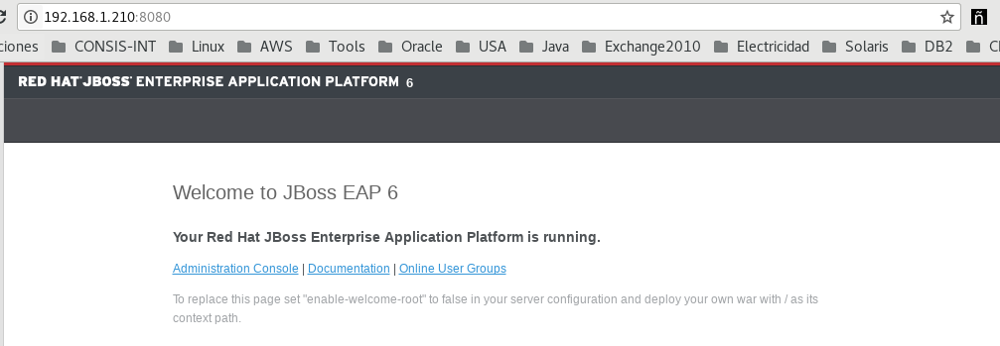
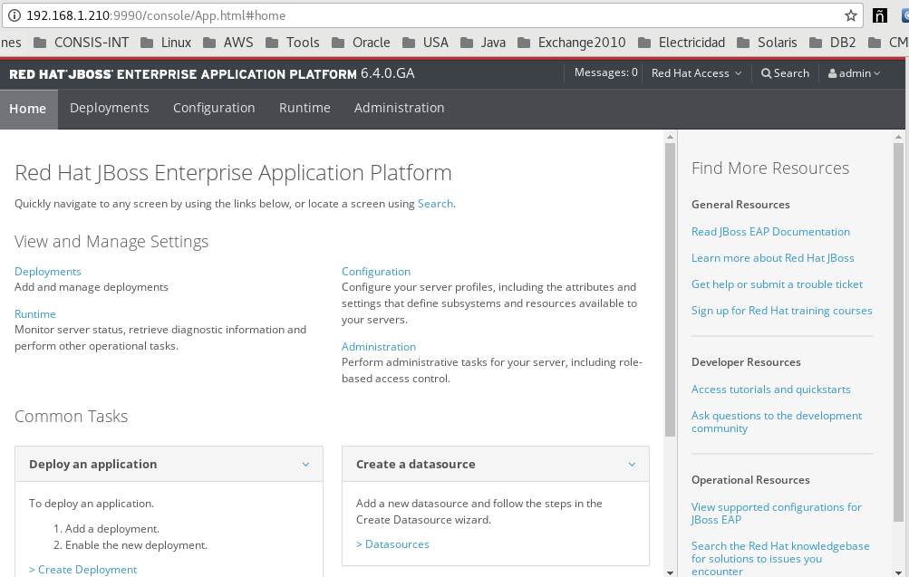
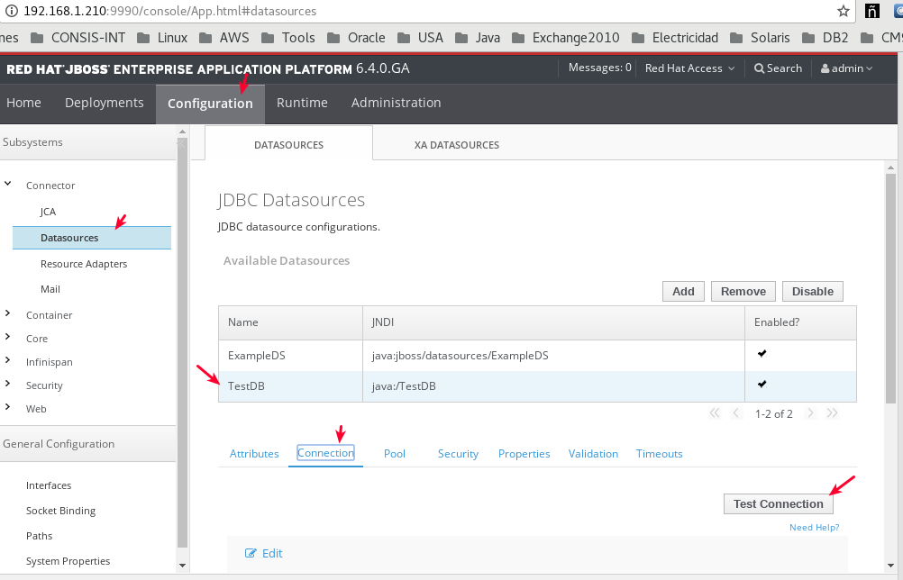
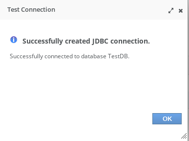
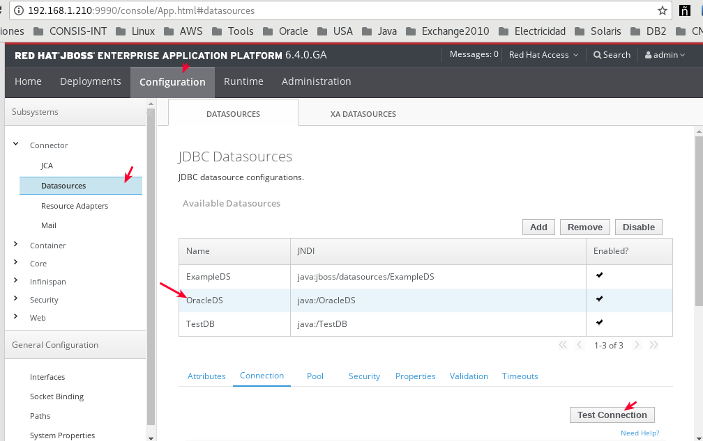
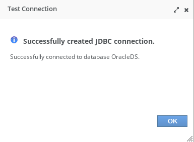

Configurar y probar Datasource 
===============================

Lo primero es leer la documentación oficial de Jboss eap.

https://access.redhat.com/documentation/en-us/jboss_enterprise_application_platform/6/html/administration_and_configuration_guide/example_oracle_datasource

https://stackoverflow.com/questions/12049882/jboss-7-oracle-datasource-configuration

https://developer.jboss.org/wiki/ConfiguracionDeDATASOURCEEnJbossAS7

https://www.oreilly.com/library/view/jboss-at-work/0596007345/ch04.html

Iniciar el laboratorio
+++++++++++++++++++++++

Instalar el Jboss EAP 6.4.::

	# unzip jboss-eap-6.4.0.zip -d /opt

Creamos el usuario admin.::

	# /opt/jboss-eap-6.4/bin/add-user.sh

Editamos el el archivo standalone.xml para que Jboss escuche por la interfaz de red que necesitemos.::

	# sed -i -e 's/127.0.0.1/192.168.1.210/g' /opt/jboss-eap-6.4/standalone/configuration/standalone.xml

Iniciamos y verificamos que no tengamos errores e ingrasamos al URL administrativo y con el usuario que creamos http://192.168.1.210:8080/ .::

	# /opt/jboss-eap-6.4/bin/standalone.sh

Para MySQL
+++++++++++

Hacemos primero una configuración que es igual para todos pero vamos a comenzar con MySQL, creamos los directorios en donde estara el driver de MySQL y el archivo module.xml que cargara dicho driver.::

	# mkdir -p /opt/jboss-eap-6.4/modules/com/mysql/main

Copiamos el driver de MySQL en la ruta creada.::

	# cp mysql-connector-java-5.1.47/mysql-connector-java-5.1.47.jar /opt/jboss-eap-6.4/modules/com/mysql/main

Creamos el archivo modules.xml con el siguiente contenido.::

	# vi /opt/jboss-eap-6.4/modules/com/mysql/main/module.xml

	<?xml version="1.0" encoding="UTF-8"?>
	<module xmlns="urn:jboss:module:1.0" name="com.mysql">
	  <resources>
	    <resource-root path="mysql-connector-java-5.1.47.jar"/>
	  </resources>
	  <dependencies>
	    <module name="javax.api"/>
	    <module name="javax.transaction.api"/>
	  </dependencies>
	</module>

Modificamos el archivo standalone.xml para agregar la configuración del Datasource.::

	# vi /opt/jboss-eap-6.4/standalone/configuration/standalone.xml
	    [...]
            <datasources>
                <datasource jndi-name="java:/TestDB" pool-name="TestDB" enabled="true" use-java-context="true">
                    <connection-url>jdbc:mysql://localhost:3306/javatest</connection-url>
                    <driver>com.mysql</driver>
                    <security>
                        <user-name>javauser</user-name>
                        <password>javadude</password>
                    </security>
                </datasource>
                <drivers>
                    <driver name="com.mysql" module="com.mysql">
                        <xa-datasource-class>com.mysql.jdbc.Driver</xa-datasource-class>
                    </driver>
                </drivers>
            </datasources>
	    [...]

Detenemos el Jboss y lo iniciamos nuevamente, no se deben visualizar errores en el LOG, hacemos un test de Conexión en la URL administrativa.

Para Oracle
+++++++++++++++

Hacemos primero una configuración que es igual para todos y ahora para Oracle, creamos los directorios en donde estara el driver de Oracle y el archivo module.xml que cargara dicho driver.::

	# mkdir -p /opt/jboss-eap-6.4/modules/com/oracle/main

Copiamos el driver de Oracle en la ruta creada.::

	# # cp ojdbc6.jar /opt/jboss-eap-6.4/modules/com/oracle/main

Creamos el archivo modules.xml con el siguiente contenido.::

	# vi /opt/jboss-eap-6.4/modules/com/oracle/main/module.xml

	<module xmlns="urn:jboss:module:1.1" name="com.oracle">
	  <resources>
	    <resource-root path="ojdbc6.jar"/>
	  </resources>
	  <dependencies>
	    <module name="javax.api"/>
	    <module name="javax.transaction.api"/>
	  </dependencies>
	</module>

Modificamos el archivo standalone.xml para agregar la configuración del Datasource.::

	# vi /opt/jboss-eap-6.4/standalone/configuration/standalone.xml
	    [...]
	<datasources>
	  <datasource jndi-name="java:/OracleDS" pool-name="OracleDS">
	    <connection-url>jdbc:oracle:thin:@192.168.1.53:1521:qa12c</connection-url>
	    <driver>oracle</driver>
	    <security>
	      <user-name>QA_RRGTGU_V138</user-name>
	      <password>QA_RRGTGU_V138</password>
	    </security> 
	    <validation>
	      <valid-connection-checker class-name="org.jboss.jca.adapters.jdbc.extensions.oracle.OracleValidConnectionChecker"></valid-connection-checker>
	      <stale-connection-checker class-name="org.jboss.jca.adapters.jdbc.extensions.oracle.OracleStaleConnectionChecker"></stale-connection-checker>
	      <exception-sorter class-name="org.jboss.jca.adapters.jdbc.extensions.oracle.OracleExceptionSorter"></exception-sorter>
	    </validation>
	  </datasource>
	  <drivers>
	    <driver name="oracle" module="com.oracle">
	      <xa-datasource-class>oracle.jdbc.xa.client.OracleXADataSource</xa-datasource-class>
	      <!--xa-datasource-class>oracle.jdbc.driver.OracleDriver</xa-datasource-class-->
	    </driver>
	  </drivers>
	</datasources>
	    [...]

Detenemos el Jboss y lo iniciamos nuevamente, no se deben visualizar errores en el LOG, hacemos un test de Conexión en la URL administrativa.

Creamos un directorio de trabajo.::

	# mkdir dbtest
	# cd dbtest

Creamos la estructura de directorios.::

	# mkdir -p images WEB-INF/classes/mypackage WEB-INF/lib

Copiamos alguna imagen.::

	# cp ../../../../tomcat.gif images/

Copiamos las librerias y los drivers (Los tenemos que descargar).::

	# cp -p ../../../../jstl.jar WEB-INF/lib/
	# cp -p ../../../../standard.jar WEB-INF/lib/
	# cp -p ../../../../ojdbc6.jar WEB-INF/lib/
	# cp -p ../../../../db2jcc.jar WEB-INF/lib/

Copiamos la clase que ya en otro momento compilamos.::

	# cp -p ../../../../Hello.class WEB-INF/classes/mypackage/

Creamos los directorios para almacenar los driver en este caso para mysql::

	# mkdir /opt/jboss-eap-6.4/modules/com/mysql/main

Copiamos el driver de MySQL.::

	# cp mysql-connector-java-5.1.47.jar /opt/jboss-eap-6.4/modules/com/mysql/main/

Creamos el archivo module.xml.::

	<?xml version="1.0" encoding="UTF-8"?>
	<module xmlns="urn:jboss:module:1.0" name="com.mysql">
	  <resources>
	    <resource-root path="mysql-connector-java-5.1.47.jar"/>
	  </resources>
	  <dependencies>
	    <module name="javax.api"/>
	    <module name="javax.transaction.api"/>
	  </dependencies>
	</module>

Editamos el standalone.xml del Jboss para agregar estas lineas dentro del subsystem xmlns="urn:jboss:domain:datasources:1.2.::

	# vi /opt/jboss-eap-6.4/standalone/configuration/standalone.xml

            <datasources>
                <datasource jndi-name="java:/TestDB" pool-name="TestDB" enabled="true" use-java-context="true">
                    <connection-url>jdbc:mysql://localhost:3306/javatest</connection-url>
                    <driver>com.mysql</driver>
                    <security>
                        <user-name>javauser</user-name>
                        <password>javadude</password>
                    </security>
                </datasource>
                <drivers>
                    <driver name="com.mysql" module="com.mysql">
                        <xa-datasource-class>com.mysql.jdbc.Driver</xa-datasource-class>
                    </driver>
                </drivers>
            </datasources>

Creamos el web.xml.::

	# vi WEB-INF/web.xml

	<?xml version="1.0" encoding="ISO-8859-1"?>
	<web-app xmlns="http://java.sun.com/xml/ns/j2ee"
	    xmlns:xsi="http://www.w3.org/2001/XMLSchema-instance"
	    xsi:schemaLocation="http://java.sun.com/xml/ns/j2ee http://java.sun.com/xml/ns/j2ee/web-app_2_4.xsd"
	    version="2.4">

	    <display-name>Hello, World Application</display-name>
	    <description>
		This is a simple web application with a source code organization
		based on the recommendations of the Application Developer's Guide.
	    </description>

	    <servlet>
		<servlet-name>HelloServlet</servlet-name>
		<servlet-class>mypackage.Hello</servlet-class>
	    </servlet>

	    <servlet-mapping>
		<servlet-name>HelloServlet</servlet-name>
		<url-pattern>/hello</url-pattern>
	    </servlet-mapping>

	  <resource-ref>
	      <description>DB Connection</description>
	      <res-ref-name>jdbc/TestDB</res-ref-name>
	      <res-type>javax.sql.DataSource</res-type>
	      <res-auth>Container</res-auth>
	  </resource-ref>

	  <!--resource-ref>
	      <description>Oracle Datasource example</description>
	      <res-ref-name>jdbc/myoracle</res-ref-name>
	      <res-type>javax.sql.DataSource</res-type>
	      <res-auth>Container</res-auth>
	  </resource-ref-->

	  <!--resource-ref>
	      <description>DB2 Datasource example</description>
	      <res-ref-name>jdbc/db2</res-ref-name>
	      <res-type>javax.sql.DataSource</res-type>
	      <res-auth>Container</res-auth>
	  </resource-ref-->

	</web-app>

Creamos el WEB-INF/jboss-web.xml.::

	# vi WEB-INF/jboss-web.xml

	<?xml version="1.0" encoding="UTF-8"?>
	<jboss-web>
	    <resource-ref>
		<res-ref-name>jdbc/TestDB</res-ref-name>
		<jndi-name>java:/TestDB</jndi-name>
	    </resource-ref>
	</jboss-web>

Creamos el index.html.::

	# vi index.html

	<html>
	<head>
	<title>Sample "Hello, World" Application</title>
	</head>
	<body bgcolor=white>

	<table border="0">
	<tr>
	<td>
	
	</td>
	<td>
	<h1>Sample "Hello, World" Application</h1>
	
This is the home page for a sample application used to illustrate the
	source directory organization of a web application utilizing the principles
	outlined in the Application Developer's Guide.
	</td>
	</tr>
	</table>

	
To prove that they work, you can execute either of the following links:
	<ul>
	<li>To a <a href="dbtestmysql.jsp">Test Datasource MySQL</a>.
	<li>To a <a href="dbtestoracle.jsp">Test Datasource Oracle</a>.
	<li>To a <a href="dbtestdb2.jsp">Test Datasource DB2</a>.
	<li>To a <a href="hello.jsp">JSP page</a>.
	<li>To a <a href="hello">servlet</a>.
	</ul>

	</body>
	</html>

Creamos una JSP solo de demo.::

	<html>
	<head>
	<title>Sample Application JSP Page</title>
	</head>
	<body bgcolor=white>

	<table border="0">
	<tr>
	<td align=center>
	
	</td>
	<td>
	<h1>Sample Application JSP Page</h1>
	This is the output of a JSP page that is part of the Hello, World
	application.
	</td>
	</tr>
	</table>

	<%= new String("Hello!") %>

	</body>
	</html>

Creamos nuestras paginas de test en JSP para cada datasource.
Para MySQL.::

	<%@page import="java.sql.*, javax.sql.*, javax.naming.*"%>
	<html>
	<head>
	<title>Using a DataSource</title>
	</head>
	<body>
	<h1>Using a DataSource</h1>
	<%
	    DataSource ds = null;
	    Connection conn = null;
	    ResultSet result = null;
	    Statement stmt = null;
	    ResultSetMetaData rsmd = null;
	    try{
	      Context context = new InitialContext();
	      Context envCtx = (Context) context.lookup("java:comp/env");
	      ds =  (DataSource)envCtx.lookup("jdbc/TestDB");
	      if (ds != null) {
		conn = ds.getConnection();
		stmt = conn.createStatement();
		result = stmt.executeQuery("SELECT * FROM testdata");
	       }
	     }
	     catch (SQLException e) {
		System.out.println("Error occurred " + e);
	      }
	      int columns=0;
	      try {
		rsmd = result.getMetaData();
		columns = rsmd.getColumnCount();
	      }
	      catch (SQLException e) {
		 System.out.println("Error occurred " + e);
	      }
	 %>
	 <table width="90%" border="1">
	   <tr>
	   <% // write out the header cells containing the column labels
	      try {
		 for (int i=1; i<=columns; i++) {
		      out.write("<th>" + rsmd.getColumnLabel(i) + "</th>");
		 }
	   %>
	   </tr>
	   <% // now write out one row for each entry in the database table
		 while (result.next()) {
		    out.write("<tr>");
		    for (int i=1; i<=columns; i++) {
		      out.write("<td>" + result.getString(i) + "</td>");
		    }
		    out.write("</tr>");
		 }
	 
		 // close the connection, resultset, and the statement
		 result.close();
		 stmt.close();
		 conn.close();
	      } // end of the try block
	      catch (SQLException e) {
		 System.out.println("Error " + e);
	      }
	      // ensure everything is closed
	    finally {
	     try {
	       if (stmt != null)
		stmt.close();
	       }  catch (SQLException e) {}
	       try {
		if (conn != null)
		 conn.close();
		} catch (SQLException e) {}
	    }
	 
	    %>
	</table>
	</body>
	</html>

Para Oracle.::

	<%@page import="java.sql.*, javax.sql.*, javax.naming.*"%>
	<html>
	<head>
	<title>Using a DataSource</title>
	</head>
	<body>
	<h1>Using a DataSource</h1>
	<%
	    DataSource ds = null;
	    Connection conn = null;
	    ResultSet result = null;
	    Statement stmt = null;
	    ResultSetMetaData rsmd = null;
	    try{
	      Context context = new InitialContext();
	      Context envCtx = (Context) context.lookup("java:comp/env");
	      ds =  (DataSource)envCtx.lookup("jdbc/myoracle");
	      if (ds != null) {
		conn = ds.getConnection();
		stmt = conn.createStatement();
		result = stmt.executeQuery("SELECT * FROM CDSE_USER");
	       }
	     }
	     catch (SQLException e) {
		System.out.println("Error occurred " + e);
	      }
	      int columns=0;
	      try {
		rsmd = result.getMetaData();
		columns = rsmd.getColumnCount();
	      }
	      catch (SQLException e) {
		 System.out.println("Error occurred " + e);
	      }
	 %>
	 <table width="90%" border="1">
	   <tr>
	   <% // write out the header cells containing the column labels
	      try {
		 for (int i=1; i<=columns; i++) {
		      out.write("<th>" + rsmd.getColumnLabel(i) + "</th>");
		 }
	   %>
	   </tr>
	   <% // now write out one row for each entry in the database table
		 while (result.next()) {
		    out.write("<tr>");
		    for (int i=1; i<=columns; i++) {
		      out.write("<td>" + result.getString(i) + "</td>");
		    }
		    out.write("</tr>");
		 }
	 
		 // close the connection, resultset, and the statement
		 result.close();
		 stmt.close();
		 conn.close();
	      } // end of the try block
	      catch (SQLException e) {
		 System.out.println("Error " + e);
	      }
	      // ensure everything is closed
	    finally {
	     try {
	       if (stmt != null)
		stmt.close();
	       }  catch (SQLException e) {}
	       try {
		if (conn != null)
		 conn.close();
		} catch (SQLException e) {}
	    }
	 
	    %>
	</table>
	</body>
	</html>

Para DB2.::

	<%@page import="java.sql.*, javax.sql.*, javax.naming.*"%>
	<html>
	<head>
	<title>Using a DataSource</title>
	</head>
	<body>
	<h1>Using a DataSource</h1>
	<%
	    DataSource ds = null;
	    Connection conn = null;
	    ResultSet result = null;
	    Statement stmt = null;
	    ResultSetMetaData rsmd = null;
	    try{
	      Context context = new InitialContext();
	      Context envCtx = (Context) context.lookup("java:comp/env");
	      ds =  (DataSource)envCtx.lookup("jdbc/db2");
	      if (ds != null) {
		conn = ds.getConnection();
		stmt = conn.createStatement();
		result = stmt.executeQuery("SELECT * FROM ALGUNATABLAAQUI");
	       }
	     }
	     catch (SQLException e) {
		System.out.println("Error occurred " + e);
	      }
	      int columns=0;
	      try {
		rsmd = result.getMetaData();
		columns = rsmd.getColumnCount();
	      }
	      catch (SQLException e) {
		 System.out.println("Error occurred " + e);
	      }
	 %>
	 <table width="90%" border="1">
	   <tr>
	   <% // write out the header cells containing the column labels
	      try {
		 for (int i=1; i<=columns; i++) {
		      out.write("<th>" + rsmd.getColumnLabel(i) + "</th>");
		 }
	   %>
	   </tr>
	   <% // now write out one row for each entry in the database table
		 while (result.next()) {
		    out.write("<tr>");
		    for (int i=1; i<=columns; i++) {
		      out.write("<td>" + result.getString(i) + "</td>");
		    }
		    out.write("</tr>");
		 }
	 
		 // close the connection, resultset, and the statement
		 result.close();
		 stmt.close();
		 conn.close();
	      } // end of the try block
	      catch (SQLException e) {
		 System.out.println("Error " + e);
	      }
	      // ensure everything is closed
	    finally {
	     try {
	       if (stmt != null)
		stmt.close();
	       }  catch (SQLException e) {}
	       try {
		if (conn != null)
		 conn.close();
		} catch (SQLException e) {}
	    }
	 
	    %>
	</table>
	</body>
	</html>

Creamos el war.::

	# zip -r dbtest.war *

Desplegamos el war en $CATALINA_HOME/webapp.::

	# cp -p dbtest.war /opt/jboss-eap-6.4/webapps/

Montamos el LOG para ir viendo lo que pasa.::

	# tail -f /opt/jboss-eap-6.4/logs/catalina.out &

Vemos la salida del LOG.::

	21-Sep-2018 10:20:17.341 INFORMACIÓN [localhost-startStop-13] org.apache.catalina.startup.HostConfig.deployWAR Despliegue del archivo [/opt/jboss-eap-6.4/webapps/dbtest.war] de la aplicación web
	21-Sep-2018 10:20:17.518 INFORMACIÓN [localhost-startStop-13] org.apache.jasper.servlet.TldScanner.scanJars Al menos un JAR, que se ha explorado buscando TLDs, aún no contenía TLDs. Activar historial de depuración para este historiador para una completa lista de los JARs que fueron explorados y de los que nos se halló TLDs. Saltarse JARs no necesarios durante la exploración puede dar lugar a una mejora de tiempo significativa en el arranque y compilación de JSP .
	21-Sep-2018 10:20:17.526 INFORMACIÓN [localhost-startStop-13] org.apache.catalina.startup.HostConfig.deployWAR Deployment of web application archive [/opt/jboss-eap-6.4/webapps/dbtest.war] has finished in [185] ms

Probamos ahora en el navegador, http:IPSERVER:8080/dbtest

Seleccionamos el link del MySQL.:

Seleccionamos el link del Oracle.:

