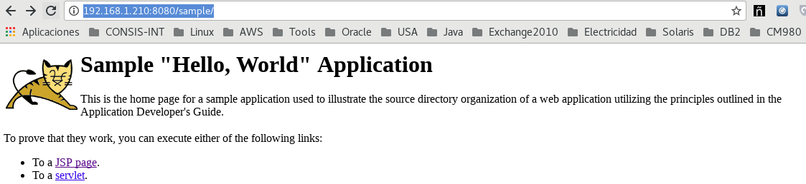

Desplegar un EAR o WAR 
======================

Para desplegar un EAR o WAR es tan simple como copiarlo en el directorio /opt/jboss-eap-6.4/standalone/deployments.::

	# cp sample.war /opt/jboss-eap-6.4/standalone/deployments/
	[root@vldappr01 ~]# 11:51:16,678 INFO  [org.jboss.as.server.deployment] (MSC service thread 1-2) JBAS015876: Iniciando la implementación de sample.war" (runtime-name: "sample.war")
	11:51:16,806 INFO  [org.jboss.web] (ServerService Thread Pool -- 67) JBAS018210: Registrar el contexto web: /sample
	11:51:17,099 INFO  [org.jboss.as.server] (DeploymentScanner-threads - 2) JBAS015859: Implementado "sample.war" (runtime-name : "sample.war")

No debemos observar errores en el LOG.

Si listamos el directorio.::

	# ls /opt/jboss-eap-6.4/standalone/deployments/
	README.txt  sample.war  sample.war.deployed

Verificamos en la URL http://192.168.1.210:8080/sample/

Si en la ruta /opt/jboss-eap-6.4/standalone/deployments/ al archivo sample.war.deployed le cambiamos al nombre a sample.war.undeployed, dejamos de tener la aplicación desplegada.::

	# mv /opt/jboss-eap-6.4/standalone/deployments/sample.war.deployed /opt/jboss-eap-6.4/standalone/deployments/sample.war.undeployed 

	# ls /opt/jboss-eap-6.4/standalone/deployments/
	README.txt  sample.war  sample.war.undeployed
	
# 11:58:45,195 INFO  [org.jboss.as.server.deployment.scanner] (DeploymentScanner-threads - 1) JBAS015019: La implementación sample.war se borró previamente por parte de este escaner pero otra herramienta de administración la volvió a implementar. Se está borrando el marcador de archivo /opt/jboss-eap-6.4/standalone/deployments/sample.war.undeployed para registrar esto.
	11:58:45,276 INFO  [org.jboss.web] (ServerService Thread Pool -- 68) JBAS018224: Borrar el registro del contexto web: /sample
	11:58:45,500 INFO  [org.jboss.as.server.deployment] (MSC service thread 1-2) JBAS015877: Se detuvo la implementaciónsample.war (runtime-name: sample.war) en 226ms
	11:58:45,697 INFO  [org.jboss.as.server] (DeploymentScanner-threads - 2) JBAS015858: Implementación borrada "sample.war" (runtime-name: "sample.war")

