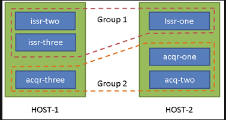

Instalar JBOSS EAP en modo Dominio
===================================

JBoss EAP (Enterprise Application Platform)Red Hat® JBoss® Enterprise Application Platform (JBoss EAP) proporciona seguridad, rendimiento y escalabilidad a nivel empresarial en cualquier entorno. Ya sea de forma local o virtual, o en nubes públicas, privadas o híbridas, JBoss EAP le puede ayudar a distribuir sus aplicaciones con mayor rapidez, en cualquier lugar.

JBoss Enterprise Application Platform (o JBoss EAP) es un servidor de aplicaciones Open Source basado en Java-EE

El modo Domain permite administrar un grupo de instancias de forma sencilla.

En cada instalación se debe evaluar la cantidad de instancias en modo Host que se desean utilizar y la cantidad de instancias en modo Slave que se levantaran en cada uno de los Hosts, por lo general esta información se obtiene a partir de las estimaciones de usuarios y llamadas concurrentes que se deberán soportar.

Comúnmente se configura un Host por servidor (físico o virtual) pero podría levantarse más de un Host en cada servidor, si el mismo cuenta con varias IPs.

Los pasos siguientes detallan la configuración a realizar para una infraestructura con dos Host (cada uno en un servidor distinto) con tres instancias/servers por HOST, todo agrupado en dos grupos.
Cada grupo será administrado de forma independiente, permitiendo desplegar las aplicaciones automáticamente en todos los servidores del grupo, así como configurar propiedades de cada uno de ellos en un único archivo.

Supongamos entonces que contamos con los siguientes servidores

Servidor 1 con IP: 10.64.70.16 el cual contendrá el Host-1 y además será el encargado de la administración, por tanto será el domain-controller.
Servidor 2 con IP: 10.64.70.170 el cual contendrá el Host-2, el mismo se conectara al domain-controller del Host-1.
El diagrama de la instalación a realizar:

Instalación de JBoss
+++++++++++++++++++++
La instalación de los servidores no difiere en nada al modo standalone, se deberán copiar los archivos de JBoss como si fuera a realizarse una instalación en modo standalone y luego configurar los servidores y grupos a utilizar.

Configuración de cada HOST
+++++++++++++++++++++++++++
Para la conexión de los distintos nodos esclavos con el domain controller será necesario contar con un usuario administrador. Para crearlo localice el script add-user.bat|sh en la carpeta JBOSS_HOME/bin del servidor 1 (el que oficiara como domain-controller).
Cree un nuevo usuario en el Realm de nombre ManagementRealm, en el último paso el script consultara por lo siguiente.::

	Is this new user going to be used for one AS process to connect to another AS process e.g. slave domain controller?
	yes/no? y
	To represent the user add the following to the server-identities definition

Contestar “yes” y copiar el tag , para su utilización a posterior, recordar el nombre de usuario elegido. Para ejemplificar supongamos fue creado el usuario “admin”.

Configurar archivo host.xml (JBOSS_HOME/domain/configuration/host.xml)
+++++++++++++++++++++++++++++++++++++++++++++++++++++++++++++++++++++++++

* Configurar el nombre del host correcto para cada servidor dentro del tag host como se muestra a continuación::

	<host name="[host1|host2]" xmlns="urn:jboss:domain:1.4">

* Para el Host-1, configurar las interfaces dentro del tag <interfaces> colocando la ip en la cual se asociara la consola de administración::

	<interfaces>
	   <interface name="management">
	      <inet-address value="${jboss.bind.address.management:10.64.70.16}"/>
	   </interface>
	   <interface name="public">
	      <inet-address value="${jboss.bind.address:10.64.70.16}"/>
	   </interface>
	....

* En el Host-1 configurar el tag <domain-controller>.::

	<domain-controller>
	       <local/>
	</domain-controller>

* En el Host-2 configurar el tag <domain-controller>.::

	<domain-controller>
	<remote host="10.64.70.16" port="${jboss.domain.master.port:9999}" username="admin" security-realm="SlaveRealm"/>
	</domain-controller>

* Definir un nuevo Realm utilizando la clave que se obtuvo en la última pregunta del script de creación de usuarios en el Host-2.::

	<security-realm name="SlaveRealm">
	<server-identities>
		<secret value="VG8kJCRUYTQ=" />
	    </server-identities>
	</security-realm>

Configuración de Grupos
++++++++++++++++++++++++++

La configuración de los servers y sus grupos se debe realizar en cada uno de los HOST, la misma se realiza en el archivo host.xml. Más adelante configuraremos  los grupos en si y sus propiedades.

Para el ejemplo planteado:

* Host-1::

	<servers>
	<server name="acq-three" group="group_2" auto-start="true">
		<socket-bindings port-offset="1000"/>
	       </server>
	<server name="issr-two" group=" group_1" >
		<socket-bindings port-offset="2000"/>           
	       </server>
	    <server name="issr-three" group="group_1" auto-start="true">
		<socket-bindings port-offset="3000"/>           
	       </server>
	</servers>

* Host-2::

	<servers>
		<server name="acq-one" group="group_2" auto-start="true">
		<socket-bindings port-offset="1000"/>
		</server>
	     <server name="acq-two" group="group_2" >
		<socket-bindings port-offset="2000"/>           
		</server>
	     <server name="issr-one" group="group_1" auto-start="true">
		<socket-bindings port-offset="3000"/>           
		</server>
	</servers>

Configuración de Perfiles
+++++++++++++++++++++++++++

La definición de los grupos y los perfiles utilizados solo es necesaria en el host que juega el rol de domain-controller, el resto de los esclavos obtienen la configuración del domain-controller al momento de iniciar y registrarse en el domain.

Para la instalación planteada debemos alterar el archivo domain.xml dentro del Host-1.::

	<server-groups>
	    <server-group name="group_1" profile="default">
		        <jvm name="default">
		            <heap size="500m" max-size="500m"/>
		            <permgen max-size="256m"/>
		        </jvm>
		        <socket-binding-group ref="full-sockets"/>            
		    </server-group>
		    <server-group name="group_2" profile="default">
		        <jvm name="default">
		            <heap size="500m" max-size="500m"/>
		            <permgen max-size="256m"/>
		        </jvm>
		        <socket-binding-group ref="full-sockets"/>
	    </server-group>
	</server-groups>

Como se puede ver en la configuración anterior, se está haciendo referencia a un profile llamado default. El mismo esta definido al comienzo del archivo, y se deberá definir en el los datasources y eñ resto de las configuraciones necesarias para el grupo.

