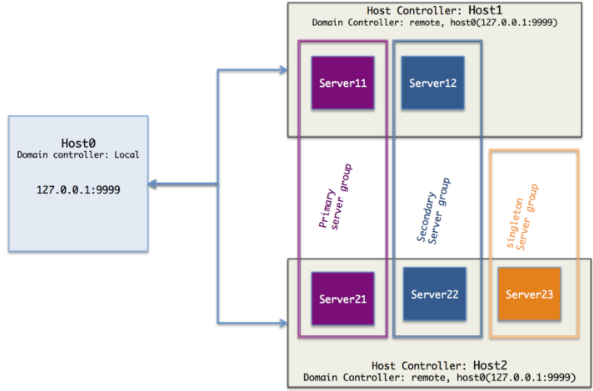
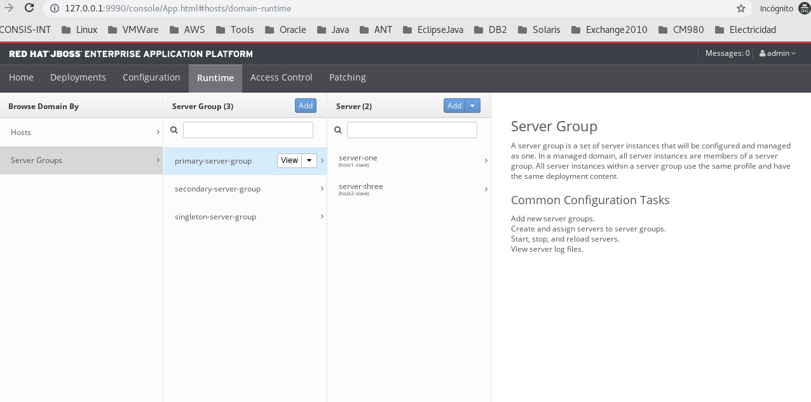
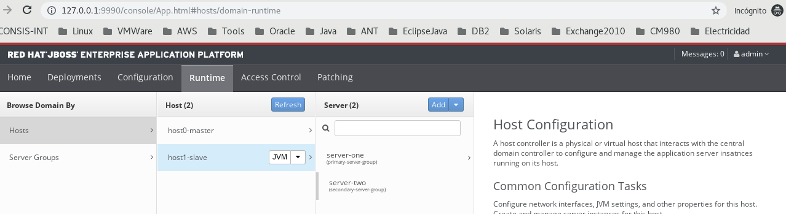
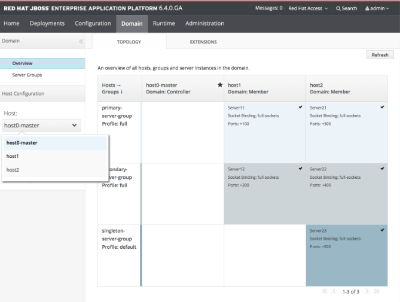
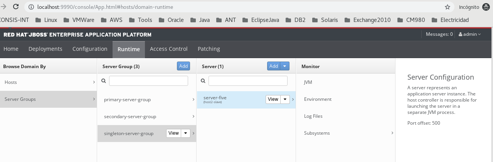

Instalar y Configurar un dominio simple de EAP 7.1.0
==================================================

Esto fue certificado con Jboss-EAP 7.1.0

NOTA: con Jboss-EAP 7.1.0 no se pudo realizar la configuración de remote Domain Controller, pero son el Jboss-EAP 7.0.0 si fue exitosa.

Vamos a configurar un dominio JBoss EAP 7.0 con los siguientes requisitos:

	* 1 Domain Controller en una máquina llamada host0
	* 1 Host Controller en una máquina host1 con dos instancias EAP Server11 y Server12
	* 1 Host Controller en una máquina host2 con tres instancias de EAP Servers21, Server22 y Server23
	* Host0 debe ejecutarse como el controlador maestro,
	* Host1 y Host2 son esclavos que se conectan a Host0
	* Server11 y Server21 son miembros del grupo de servidores primario (nombre = primary-server-group)
	* Server12 y Server22 pertenecen al grupo de servidores secundarios (nombre = secundary-server-group)
	* Server23 es el único miembro del grupo de servidores singleton (nombre = singleton-server-group)
	* En la vida real las maquinas Host0, Host1, Host2 se encuentra en su mayoría en una ubicación física diferente o en maquinas virtuales diferentes, pero para el propósito de este tutorial los simularemos en el mismo localhost utilizando una instalación EAP 7.1.0 y diferentes carpetas de configuración para cada Máquina.
	* Para mantenerlo simple, no cubriremos la configuración de JVM en detalle en esta parte.

Configuración del Workspace
Para completar el paso de la instalación, primero vamos a preparar el Workspace, crear la estructura de directorios, descargar e instalar EAP 7.1, luego configurar los hosts master y slaves.

Usaré /opt/jboss/lab/ como carpeta raíz 

En esta carpeta raíz, se crear una subcarpeta de laboratorios y 3 subcarpetas en ella, para los diferentes archivos de configuración de hosts::

	$ mkdir -p /opt/jboss/lab/{host0,host1,host2}

Instalar Jboss EAP
++++++++++++++++++++++

Visite Red Hat Developers para descargar el archivo zip EAP 7.1.0 y extraerlo en la carpeta /opt/jboss/lab/::

	$ jboss-eap-7.1.0.zip -d /opt/jboss/lab/

Ahora tendrá las siguientes subcarpetas en los laboratorios::

	host0 
	host1 
	host2 
	jboss-eap-7.1.0

En la vida real, tendría un binario de instalación separado para cada host, pero para este tutorial usaremos los mismos binarios de instalación compartidos por los 3 hosts.

Los archivos de configuración que se utilizarán para cada host se especificarán en el comando de inicio. Esta es una práctica recomendada que le permite ejecutar varias instancias de EAP en modo Dominio en la misma máquina usando los mismos archivos de instalación. También le permite actualizar a una versión más nueva de EAP sin afectar o sobrescribir sus archivos de configuración.

Crear Management User
++++++++++++++++++++++

Cree un usuario de administración adminusando la secuencia de comandos add-user::

	./add-user.sh 

	¿Qué tipo de usuario desea agregar? 
	 a) Usuario de administración (mgmt-users.properties) 
	 b) Usuario de la aplicación (application-users.properties)
	(a): a

	Introduzca los detalles del nuevo usuario a agregar.
	Usando el dominio 'ManagementRealm' tal como se descubre en los archivos de propiedades existentes.
	Nombre del usuario : admin
	El usuario 'admin' ya existe y está habilitado,  ¿quiere ... 
	 a). Actualice la contraseña del usuario y los roles 
	 b) Habilite el usuario existente 
	 c) Escriba un nuevo nombre de usuario.
	(a): a
	Las recomendaciones de la contraseña se listan a continuación. Para modificar estas restricciones modifique el archivo de configuración add-user.properties.
	 - La contraseña debe ser diferente al nombre de usuario
	 - La contraseña no debe ser uno de los siguientes valores restringidos {root, admin, administrator}
	 - La contraseña debe tener por lo menos 8 caracteres, 1 caracteres alfabéticos, 1 dígito(s), 1 símbolos que no sean alfanuméricos
	Contraseña : 
	Reintroduzca la contraseña : 
	¿ A qué grupos quiere que este usuario pertenezca? (introduzca una lista o deje en blanco para ninguno)[  ]: 
	Usuario actualizado 'admin' al archivo '/opt/jboss/lab/jboss-eap-7.1/standalone/configuration/mgmt-users.properties'
	Usuario actualizado 'admin' al archivo '/opt/jboss/lab/jboss-eap-7.1/domain/configuration/mgmt-users.properties'
	Se actualizó el usuario 'admin' con los grupos ' al archivo '/opt/jboss/lab/jboss-eap-7.1/standalone/configuration/mgmt-groups.properties'
	Se actualizó el usuario 'admin' con los grupos ' al archivo '/opt/jboss/lab/jboss-eap-7.1/domain/configuration/mgmt-groups.properties'
	¿Este nuevo usuario se va a utilizar para que un proceso AS se conecte a otro proceso AS?  
	 por ejemplo: para que un controlador host de esclavos se conecte al maestro o para una conexión remota para llamadas EJB de servidor a servidor.
	¿si/no? y
	Para representar el usuario agregue lo siguiente a la definición del servidor-identidades <secret value="VmVuZXp1ZWxhLjIx" />

Puedes obtener el base64 de esta forma::

	$ echo -n 'Venezuela.21' | openssl enc -base64
	VmVuZXp1ZWxhLjIx

Creando configuration files
+++++++++++++++++++++++++++++

Ahora vamos a replicar la configuración actual en los 3 hosts individuales antes de continuar. Inicialice los archivos de configuración para cada host copiando la carpeta jboss-eap-7.1.0 /domain en cada uno de los tres hosts.::

	cp -r /opt/jboss/lab/jboss-eap-7.1/domain/ host0/domain

	cp -r /opt/jboss/lab/jboss-eap-7.1/domain/ host1/domain

	cp -r /opt/jboss/lab/jboss-eap-7.1/domain/ host2/domain

Esto debería incluir tres subcarpetas en hostX /domain::

	configuration/
	data/
	tmp/

Ahora tenemos la configuración básica en la que podemos confiar para configurar un Domain Controller Master en host0 y slaves. Host Controllers en host1 y host2.

Configurar the Domain Controller/Master en Host0
+++++++++++++++++++++++++++++++++++++++++++++++++

La configuración del controlador de dominio se establece en dos archivos: host.xml y domain.xml

Host.xml
+++++++++++

Edite el archivo host-master.xml ubicado en host0/domain/configuration Reemplace el maestro de nombre de host con host0-master::

	<host xmlns="urn:jboss:domain:5.0" name="host0-master">

Compruebe la configuración del controlador de dominio::

	<domain-controller>
	    <local/>
	</domain-controller>

Esto significa que host0 es nuestro Domain Controller; Veremos la diferencia con un Host Constroller simple en la siguiente sección.

Ahora compruebe los parámetros de la interfaz de gestión::

    <interfaces>
        <interface name="management">
            <inet-address value="${jboss.bind.address.management:127.0.0.1}"/>
        </interface>
    </interfaces>

Indique la dirección de gestión del Domain Controller, al igual que el puerto nativo en el que este Domain Controller está escuchando::

        <management-interfaces>
            <native-interface security-realm="ManagementRealm">
                <socket interface="management" port="${jboss.management.native.port:9999}"/>
            </native-interface>
            <http-interface security-realm="ManagementRealm">
                <http-upgrade enabled="true"/>
                <socket interface="management" port="${jboss.management.http.port:9990}"/>
            </http-interface>
        </management-interfaces>

Indique el puerto HTTP para acceder a la Interfaz de administración (API REST o Consola de administración)

Domain.xml
++++++++++++

El archivo domain.xml contiene la configuración global del dominio, pero por ahora solo vamos a crear los tres grupos de servidores a los que se hará referencia host1 y host2.

En el Domain Controller no vamos a crear server, aunque si podemos colocando la configuración del tag <servers>

Los grupos de enlace de JVM y socket están predeterminados y personalizaremos estos elementos en cada host. Agregue los siguientes elementos a la sección de grupos de servidores para agregar grupos de servidores primarios, secundarios y singleton::

    <server-groups>
        <server-group name="primary-server-group" profile="full">
            <jvm name="default">
                <heap size="1000m" max-size="1000m"/>
            </jvm>
            <socket-binding-group ref="full-sockets"/>
        </server-group>
        <server-group name="secondary-server-group" profile="full-ha">
            <jvm name="default">
                <heap size="1000m" max-size="1000m"/>
            </jvm>
            <socket-binding-group ref="full-ha-sockets"/>
        </server-group>
        <server-group name="singleton-server-group" profile="full-ha">
            <jvm name="default">
                <heap size="1000m" max-size="1000m"/>
            </jvm>
            <socket-binding-group ref="full-ha-sockets"/>
        </server-group>
    </server-groups>

Ahora podemos iniciar el controlador de dominio.

Iniciar el domain controller
++++++++++++++++++++++++++++++++

Por defecto, el script domain.sh comienza con el archivo host.xml, por lo que tenemos que usar la opción –host-config para señalar host-master.xml, En segundo lugar, tenemos que especificar el directorio base de jefe para host0: host0/domain::

	/opt/jboss/lab/jboss-eap-7.1/bin/domain.sh --host-config=host-master.xml -Djboss.domain.base.dir=/opt/jboss/lab/host0/domain/

Ahora podemos conectarnos al dominio usando http://localhost:9990 usando el usuario admin y navegar por la configuración del dominio. Puede ver el host0-master y los diferentes grupos de servidores que agregamos en domain.xml. Todas estas configuraciones se pueden hacer también en la consola de administración:

Configurar Host Controller en Host1 y Host2
++++++++++++++++++++++++++++++++++++++++++++

Un Host Controller interactúa con el Master Controller de dominio para administrar las instancias de Servidores ubicadas en la misma máquina. Cada controlador se configura en un archivo domain/configuration/host.xml.

Para configurar un esclavo en host1, lo primero que debe hacer es registrar el controlador de dominio remoto en el archivo host-slave.xml. Aquí está la estructura general de este archivo::

	<host name="host1" xmlns="urn:jboss:domain:1.7">
	    <system-properties>
		...for defining system properties
	    </system-properties>
	    <paths>
		...for defining filesystem paths of the host
	    </paths>
	    <vault>
		 ...for storing encrypted passwords
	    </vault>
	    <management>
		...the management interfaces: Asegure de no utilizar los mismos puertos with host0 or host2
	    </management>
	    <domain-controller>
		...Esta configuración es como se conectaran los Host Controller al domain controller remoto ( host0-master)
	    </domain-controller>
	    <interfaces>
		...interfaces are defined here
	    </interfaces>
	    <jvms>
		...JVMs definitions
	    </jvms>
	    <servers>
	   ...Servers hosted on this host
	    </servers>
	</host>

Edite el archivo host-slave.xml ubicado en host1/domain/configuration Reemplace el master de nombre de host con host1-slave::

	<host name="host1-slave" xmlns="urn:jboss:domain:5.0">

Para hacer referencia al controlador de dominio remoto, tenemos que usar la siguiente configuración para hacer referencia al maestro definido en host0::

    <domain-controller>
       <remote host="${jboss.domain.master.address:127.0.0.1}" port="${jboss.domain.master.port:9999}" security-realm="ManagementRealm"/>
    </domain-controller>

NOTA: la configuración anterior se probo con un Jboss-eap 7.0.0 y funciono con esto::

        <remote protocol="remote" host="192.168.1.66" port="9999" security-realm="ManagementRealm" username="admin"/>

y se agrego en el security-realms lo siguiente, recuerda si solo si, el Domain Controller esta remoto, es decir en otro equipo::

        <security-realms>
            <security-realm name="ManagementRealm">
                <server-identities>
                    <!-- Replace this with either a base64 password of your own, or use a vault with a vault expression -->
                    <secret value="VmVuZXp1ZWxhLjIx"/>
                </server-identities>
                <...>
            </security-realm>

Debido a que la interfaz de administración nativa en el controlador de dominio host0 ya está utilizando el puerto predeterminado 9999 para evitar conflictos de puertos, vamos a utilizar los puertos 19999 para la interfaz de administración nativa host1. Utilice 29999 para host2. Tenga en cuenta que no tenemos una interfaz de administración HTTP para los controladores host esclavos. La interfaz de administración HTTP del dominio en host0: 9990 es suficiente.::

        <management-interfaces>
            <native-interface security-realm="ManagementRealm">
                <socket interface="management" port="${jboss.management.native.port:19999}"/>
            </native-interface>
        </management-interfaces>
    </management>

Ahora vamos a configurar los servidores - Server11 y Server12 de host1 en la sección de servers::

    <servers>
        <server name="server-one" group="primary-server-group">
            <socket-bindings port-offset="100"/>
        </server>
        <server name="server-two" group="secondary-server-group">
            <socket-bindings port-offset="200"/>
        </server>
    </servers>

El atributo de grupo se refiere al nombre del grupo de servidores definido en domain.xml en host0, para evitar conflictos de puertos, estamos asignando un desplazamiento de puerto de 100 a Server11 y 200 a Server12. Con esta configuración, por ejemplo, dado que el puerto 8080 de enlace completo de socket /socket utiliza para el tráfico HTTP, server11 escuchará en el puerto http 8180 y server12 en el puerto 8280

Ahora podemos iniciar el controlador host1 con el siguiente comando::

	/opt/jboss/lab/jboss-eap-7.1/bin/domain.sh --host-config=host-slave.xml -Djboss.domain.base.dir=/opt/jboss/lab/host1/domain/

Puedes ver los registros de inicio de server11 y server12::

	[Host Controller] 11:16:02,243 INFO  [org.jboss.as.host.controller] (Controller Boot Thread) WFLYHC0148: Conectado al controlador del host maestro en remote://127.0.0.1:9999
	[Host Controller] 11:16:02,281 INFO  [org.jboss.as.host.controller] (Controller Boot Thread) WFLYHC0023: Iniciando el servidor server-one
	11:16:02,331 INFO  [org.jboss.as.process.Server:server-one.status] (ProcessController-threads - 3) WFLYPC0018: Iniciando el proceso 'Server:server-one'
	[Host Controller] 11:16:04,001 INFO  [org.jboss.as.host.controller] (management task-1) WFLYHC0021: Servidor [Server:server-one] conectado utilizando la conexión [Channel ID 6c7798ac (inbound) of Remoting connection 13e0dfff to localhost/127.0.0.1:33089 of endpoint "host1-slave:MANAGEMENT" <1117db36>]
	[Host Controller] 11:16:04,023 INFO  [org.jboss.as.host.controller] (Controller Boot Thread) WFLYHC0023: Iniciando el servidor server-two
	[Host Controller] 11:16:04,044 INFO  [org.jboss.as.host.controller] (server-registration-threads - 1) WFLYHC0020: Registrando el servidor server-one
	11:16:04,068 INFO  [org.jboss.as.process.Server:server-two.status] (ProcessController-threads - 3) WFLYPC0018: Iniciando el proceso 'Server:server-two'
	[Host Controller] 11:16:07,311 INFO  [org.jboss.as.host.controller] (management task-5) WFLYHC0021: Servidor [Server:server-two] conectado utilizando la conexión [Channel ID 503768d1 (inbound) of Remoting connection 72469e19 to localhost/127.0.0.1:58931 of endpoint "host1-slave:MANAGEMENT" <1117db36>]
	[Host Controller] 11:16:07,334 INFO  [org.jboss.as.host.controller] (server-registration-threads - 1) WFLYHC0020: Registrando el servidor server-two
	[Host Controller] 11:16:07,370 INFO  [org.jboss.as] (Controller Boot Thread) WFLYSRV0025: JBoss EAP 7.1.0.GA (WildFly Core 3.0.10.Final-redhat-1) (Host Controller) inició en 8938ms - Inició 69 de 72 servicios (21 servicios son perezosos, pasivos o por demanda)

Y en el LOG del Domain Controller debe visualizar que se registro::

	[Host Controller] 11:16:02,229 INFO  [org.jboss.as.domain.controller] (Host Controller Service Threads - 3) WFLYHC0019: Host esclavo remoto registrado "host1-slave", JBoss JBoss EAP 7.1.0.GA (WildFly 3.0.10.Final-redhat-1)

Si se desconecta en el LOG del Domain Controller debe ver::

	[Host Controller] 11:16:37,333 INFO  [org.jboss.as.domain.controller] (management task-7) WFLYHC0026: Unregistered remote slave host "host1-slave"

El proceso es similar para Host2, pero puede usar la consola de administración para completar la configuración después de iniciar host2 con el siguiente comando::

	/opt/jboss/lab/jboss-eap-7.1/bin/domain.sh --host-config=host-slave.xml -Djboss.domain.base.dir=/opt/jboss/lab/host2/domain/

En el enlace de socket Realice la misma configuración de desplazamiento de puerto en host2 para tener tráfico de HTTP en los siguientes puertos, para que los puertos queden así server21(8380), server22(8480) and server23(8580)::

    <servers>
        <server name="server-three" group="primary-server-group">
            <socket-bindings port-offset="300"/>
        </server>
        <server name="server-four" group="secondary-server-group">
            <socket-bindings port-offset="400"/>
        </server>
        <server name="server-five" group="singleton-server-group" auto-start="true">
            <socket-bindings port-offset="500"/>
        </server>
    </servers>

Después de configurar Host2, la configuración del dominio está completa y podemos ver nuestra topología de infraestructura con la lista de instancias de EAP en http://localhost:9990/console/App.html#topology:

En EAP 6.4, la topología del dominio se ve así.

JBoss EAP 7 incluye una interfaz de usuario de la consola de administración actualizada, que incluye una navegación más sencilla y un mejor soporte para configuraciones de dominio a gran escala.

Articulos utilizados:

https://developers.redhat.com/blog/2016/07/28/jboss-eap-7-domain-deployments-part-1-setup-a-simple-eap-domain/

https://www.middlewarebox.com/2018/02/a-domain-controller-is-central-point.html

