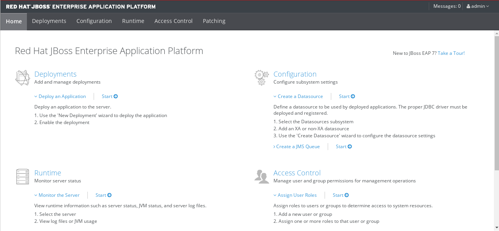
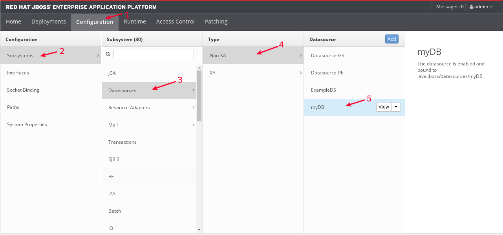
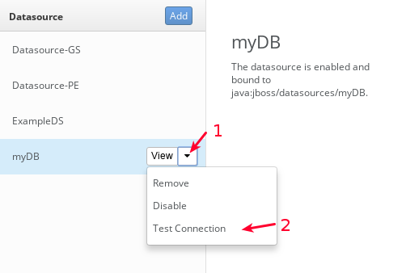
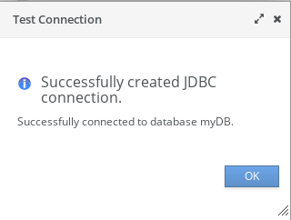

Configurar y probar Datasource para Micosoft SQL Server
===============================

Debe tener instalado la versión que se requiera de **jboss-eap** para este ejemplo sera con **jboss-eap-7.1.0**

Para Micosoft SQL Server
+++++++++++++++

Creamos los directorios en donde estará el driver de Oracle y el archivo module.xml que cargara dicho driver.::

	# mkdir -p net/sourceforge/jtds/main

Copiamos el driver de Oracle en la ruta creada.::

	# cp jtds-1.3.1-dist.zip /opt/jboss/jboss-eap-7.1.0/modules/net/sourceforge/jtds/mainnet/sourceforge/jtds/main

Creamos el archivo modules.xml con el siguiente contenido.::

	# vi /opt/jboss/jboss-eap-7.1.0/modules/net/sourceforge/jtds/main/module.xml

	<?xml version="1.0" encoding="UTF-8"?>
	<module xmlns="urn:jboss:module:1.0" name="net.sourceforge.jtds">
	  <resources>
	    <resource-root path="jtds-1.3.1.jar"/>
		<!-- Insert resources here -->
	  </resources>
	  <dependencies>
	    <module name="javax.api"/>
	    <module name="javax.transaction.api"/>
	  </dependencies>
	</module>

Modificamos el archivo standalone.xml para agregar la configuración del Datasource. Debe ser dentro del TAG **datasources** y **drivers**::

	# vi /opt/jboss-eap-7.1.0/standalone/configuration/standalone.xml

	    [...]

	<datasource jndi-name="java:jboss/datasources/myDB" pool-name="myDB" enabled="true" use-java-context="true">
		<connection-url>jdbc:jtds:sqlserver://192.168.0.94:1433/SRVMSSQL;loginTimeout=30</connection-url>
		<driver>JTDS</driver>
		<new-connection-sql>select 1</new-connection-sql>
		<transaction-isolation>TRANSACTION_READ_COMMITTED</transaction-isolation>
		<pool>
			<min-pool-size>5</min-pool-size>
			<max-pool-size>50</max-pool-size>
		</pool>
		 <security>
			<user-name>BXPLUS_V138</user-name>
			<password>BXPLUS_V138</password>
		</security>
		<validation>
			<check-valid-connection-sql>select 1</check-valid-connection-sql>
		</validation>
		<timeout>
			<set-tx-query-timeout>true</set-tx-query-timeout>
			<blocking-timeout-millis>5000</blocking-timeout-millis>
			<idle-timeout-minutes>15</idle-timeout-minutes>
		</timeout>
		<statement>
			<track-statements>false</track-statements>
		</statement>
		</datasource>
	</datasources>
	<drivers>
		<driver name="JTDS" module="net.sourceforge.jtds">
			<driver-class>net.sourceforge.jtds.jdbc.Driver</driver-class>
		</driver>
	</drivers>

	    [...]

Detenemos el Jboss y lo iniciamos nuevamente, no se deben visualizar errores en el LOG, hacemos un test de Conexión en la URL administrativa.

