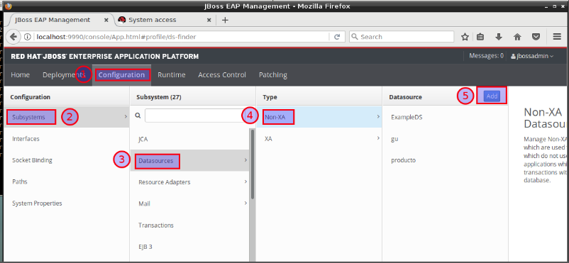
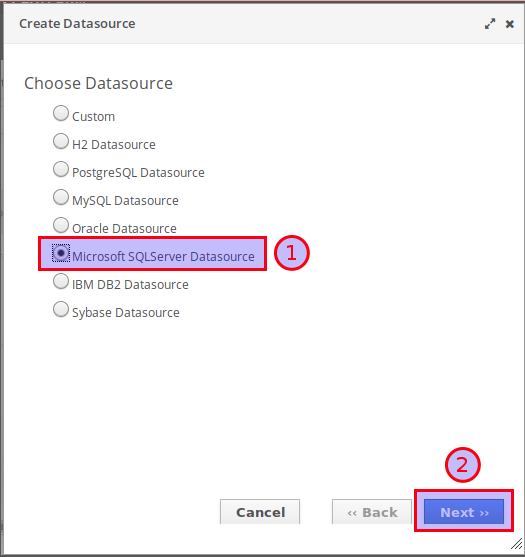
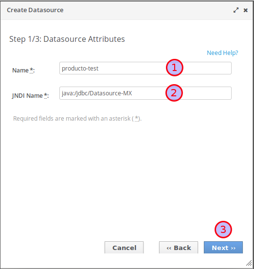
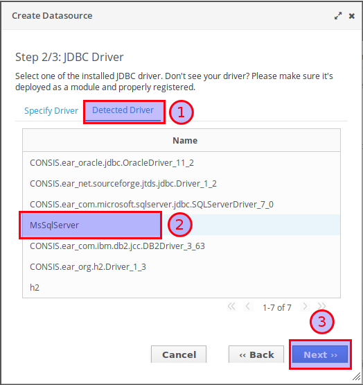
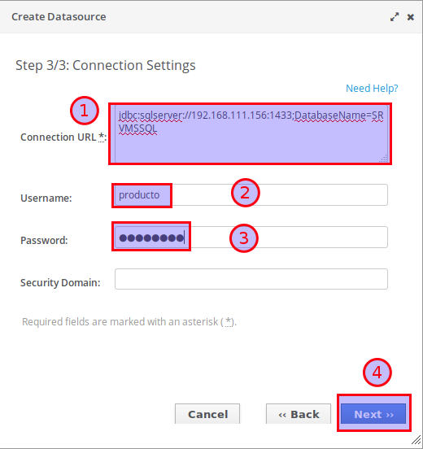
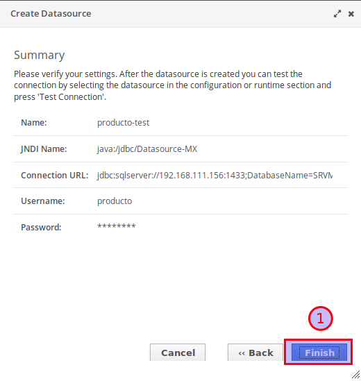
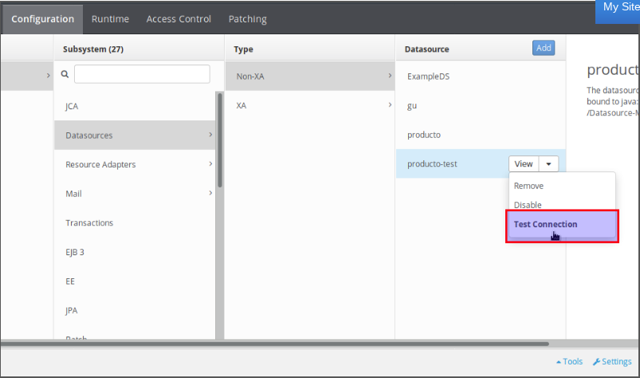
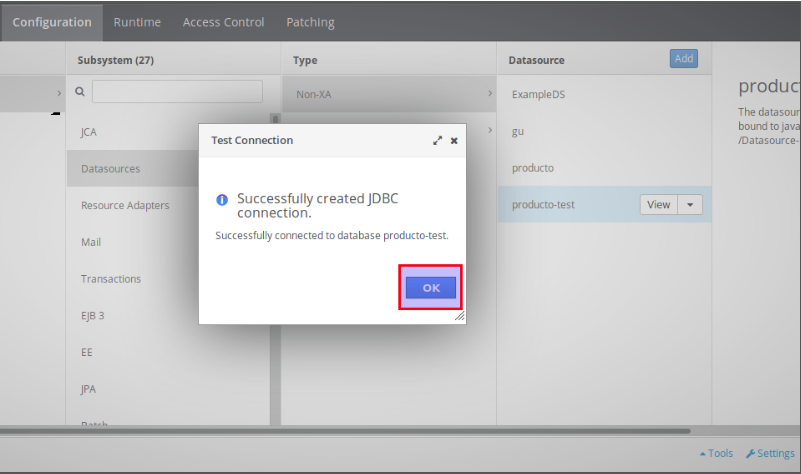

Datasource para Micosoft SQL Server
=======================================

Debe tener instalado la versión que se requiera de **jboss-eap** para este ejemplo sera con **jboss-eap-7.1.0**

Para Micosoft SQL Server
+++++++++++++++

Para poder configurar un Datasource de Microsoft Sql Server en JBoss, es necesario agregar un módulo de sistema nuevo, que contengan el driver de Sql Server, junto con todas sus dependencias necesarias.

Pasos
+++++++++++

* Descargar el módulo comprimido en formato .zip que se encuentra en la sección Recursos.
* Descomprimir el archivo .zip en el directorio <JBoss>/modules/system/layers/base/com/microsoft.
* Agregar la sección del driver SqlServer en el archivo de configuración standalone.xml, ubicado en <JBoss>/standalone/configuration.
* Esta sección debe estar ubicada dentro de la sección <subsystem xmlns="urn:jboss:domain:datasources:4.0">/<datasources>/<drivers>.
::

    <driver name="MsSqlServer" module="com.microsoft.sqlserver.jdbc">
        <xa-datasource-class>com.microsoft.sqlserver.jdbc.SQLServerDriver</xa-datasource-class>
    </driver>

* Iniciar el servidor JBoss.
* Ingresar en la Consola de Administración de JBoss.
* Ejecutar la opción Add en la sección Configuration -> Subsystems -> Datasources -> Non-XA.

* Seleccionar la opción Microsoft SQLServer Datasource y continuar.

* Ingresar el nombre del datasource, y el Nombre JNDI (se debe dejar el prefijo java:). Luego continuar.

* Seleccionar el Driver JDBC configurado en el archivo standalone.xml. Se debe ingresar en la sección Detected Driver, escoger el nombre del driver configurado, y luego continuar.

* Definir el URL de la conexión, y las credenciales del usuario de BD. Para el caso del url, el prefijo debe quedar jdbc:sqlserver (eliminar la palabra microsoft si está presente). Luego continuar.

* Confirmar la configuración del Datasource, y finalizar.

* Verificar la conexión del Datasource usando la opción Test Connection. ubicada en la caja de opciones del Datasource recien creado.

