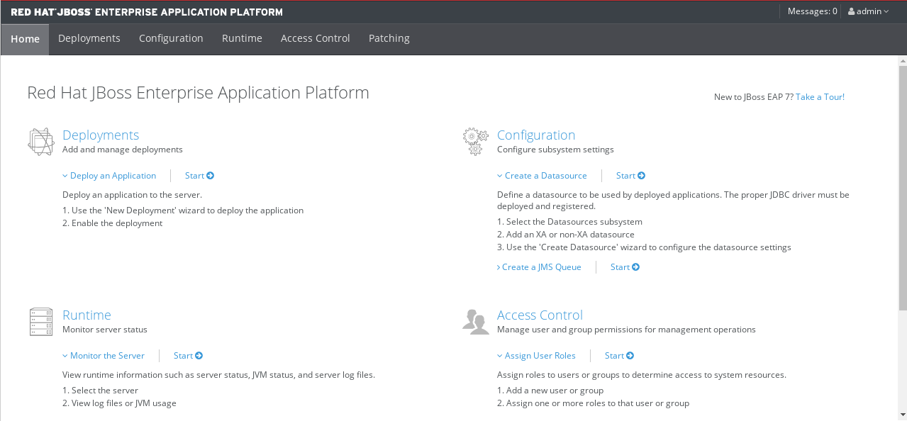

Configurar y probar Datasource 
===============================

Debe tener instalado la versión que se requiera de **jboss-eap** para este ejemplo sera con **jboss-eap-7.1.0**

Para Oracle
+++++++++++++++

Creamos los directorios en donde estará el driver de Oracle y el archivo module.xml que cargara dicho driver.::

	# mkdir -p /opt/jboss-eap-7.1.0/modules/com/oracle/main

Copiamos el driver de Oracle en la ruta creada.::

	# cp ojdbc6.jar /opt/jboss-eap-7.1.0/modules/com/oracle/main

Creamos el archivo modules.xml con el siguiente contenido.::

	# vi /opt/jboss-eap-7.1.0/modules/com/oracle/main/module.xml

	<module xmlns="urn:jboss:module:1.1" name="com.oracle">
	  <resources>
	    <resource-root path="ojdbc6.jar"/>
	  </resources>
	  <dependencies>
	    <module name="javax.api"/>
	    <module name="javax.transaction.api"/>
	  </dependencies>
	</module>

Modificamos el archivo standalone.xml para agregar la configuración del Datasource. Debe ser dentro del TAG **datasources**, el Jboss trae un datasource de ejemplo para una base de dato **h2**, dejamos la configuración solo como punto de referencia::

	# vi /opt/jboss-eap-7.1.0/standalone/configuration/standalone.xml

	    [...]
	    <datasources>
                <datasource jndi-name="java:jboss/datasources/ExampleDS" pool-name="ExampleDS" enabled="true" use-java-context="true">
                    <connection-url>jdbc:h2:mem:test;DB_CLOSE_DELAY=-1;DB_CLOSE_ON_EXIT=FALSE</connection-url>
                    <driver>h2</driver>
                    <security>
                        <user-name>sa</user-name>
                        <password>sa</password>
                    </security>
                </datasource>
                <datasource jndi-name="java:/jdbc/Datasource-PE" pool-name="Datasource-PE">
                    <connection-url>jdbc:oracle:thin:@192.168.1.53:1521:qa12c</connection-url>
                    <driver>oracle</driver>
                    <security>
                        <user-name>DES_RIMAC_V138_X</user-name>
                        <password>DES_RIMAC_V138_X</password>
                    </security>
                    <validation>
                        <valid-connection-checker class-name="org.jboss.jca.adapters.jdbc.extensions.oracle.OracleValidConnectionChecker"/>
                        <stale-connection-checker class-name="org.jboss.jca.adapters.jdbc.extensions.oracle.OracleStaleConnectionChecker"/>
                        <exception-sorter class-name="org.jboss.jca.adapters.jdbc.extensions.oracle.OracleExceptionSorter"/>
                    </validation>
                </datasource>
                <datasource jndi-name="java:/jdbc/Datasource-GS" pool-name="Datasource-GS">
                    <connection-url>jdbc:oracle:thin:@192.168.1.53:1521:qa12c</connection-url>
                    <driver>oracle</driver>
                    <security>
                        <user-name>DES_RIMACGU_V138_X</user-name>
                        <password>DES_RIMACGU_V138_X</password>
                    </security>
                    <validation>
                        <valid-connection-checker class-name="org.jboss.jca.adapters.jdbc.extensions.oracle.OracleValidConnectionChecker"/>
                        <stale-connection-checker class-name="org.jboss.jca.adapters.jdbc.extensions.oracle.OracleStaleConnectionChecker"/>
                        <exception-sorter class-name="org.jboss.jca.adapters.jdbc.extensions.oracle.OracleExceptionSorter"/>
                    </validation>
                </datasource>
                <drivers>
                    <driver name="h2" module="com.h2database.h2">
                        <xa-datasource-class>org.h2.jdbcx.JdbcDataSource</xa-datasource-class>
                    </driver>
                    <driver name="oracle" module="com.oracle">
                        <xa-datasource-class>oracle.jdbc.xa.client.OracleXADataSource</xa-datasource-class>
                    </driver>
                </drivers>
            </datasources>

	    [...]

Detenemos el Jboss y lo iniciamos nuevamente, no se deben visualizar errores en el LOG, hacemos un test de Conexión en la URL administrativa.

