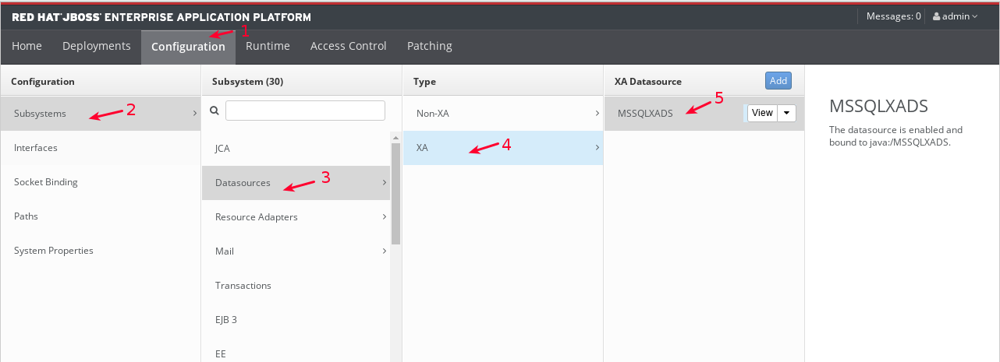
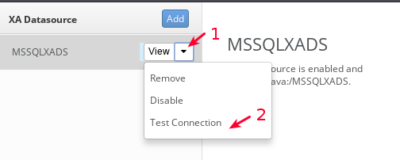
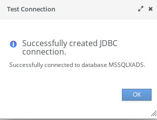

Configurar y probar Datasource XA para Micosoft SQL Server
===============================

Debe tener instalado la versión que se requiera de **jboss-eap** para este ejemplo sera con **jboss-eap-7.1.0**

Para Micosoft SQL Server
+++++++++++++++

Descargar el driver:

sqljdbc4.jar

Creamos los directorios en donde estará el driver de Oracle y el archivo module.xml que cargara dicho driver.::

	# mkdir -p /opt/jboss/jboss-eap-7.1.0/modules/com/microsoft/main

Copiamos el driver de Oracle en la ruta creada.::

	# cp sqljdbc4.jar /opt/jboss/jboss-eap-7.1.0/modules/com/microsoft/main

Creamos el archivo modules.xml con el siguiente contenido.::

	# vi /opt/jboss/jboss-eap-7.1.0/modules/com/microsoft/main/module.xml

	<module xmlns="urn:jboss:module:1.1" name="com.microsoft">
	  <resources>
	    <resource-root path="sqljdbc4.jar"/>
	  </resources>
	  <dependencies>
	    <module name="javax.api"/>
	    <module name="javax.transaction.api"/>
	  </dependencies>
	</module>

Modificamos el archivo standalone.xml para agregar la configuración del Datasource. Debe ser dentro del TAG **datasources** y **drivers**::

	# vi /opt/jboss-eap-7.1.0/standalone/configuration/standalone.xml

	    [...]

	<datasources>
	  <xa-datasource jndi-name="java:/MSSQLXADS" pool-name="MSSQLXADS">
	    <driver>sqlserver</driver>
	    <xa-datasource-property name="ServerName">192.168.0.94</xa-datasource-property>
	    <xa-datasource-property name="DatabaseName">SRVMSSQL</xa-datasource-property>
	    <xa-datasource-property name="SelectMethod">cursor</xa-datasource-property>
	    <security>
	      <user-name>BXPLUS_V138</user-name>
	      <password>BXPLUS_V138</password>
	    </security>
	    <xa-pool>
	      <is-same-rm-override>false</is-same-rm-override>
	    </xa-pool>
	    <validation>
	      <background-validation>true</background-validation>
	      <valid-connection-checker class-name="org.jboss.jca.adapters.jdbc.extensions.mssql.MSSQLValidConnectionChecker"></valid-connection-checker>
	    </validation>
	  </xa-datasource>
		</datasources>
	<drivers>
	    <driver name="sqlserver" module="com.microsoft">
	      <xa-datasource-class>com.microsoft.sqlserver.jdbc.SQLServerXADataSource</xa-datasource-class>
	    </driver>
	</drivers>

	    [...]

Detenemos el Jboss y lo iniciamos nuevamente, no se deben visualizar errores en el LOG, hacemos un test de Conexión en la URL administrativa.

.. figure:: ../images/datasource/07.png

